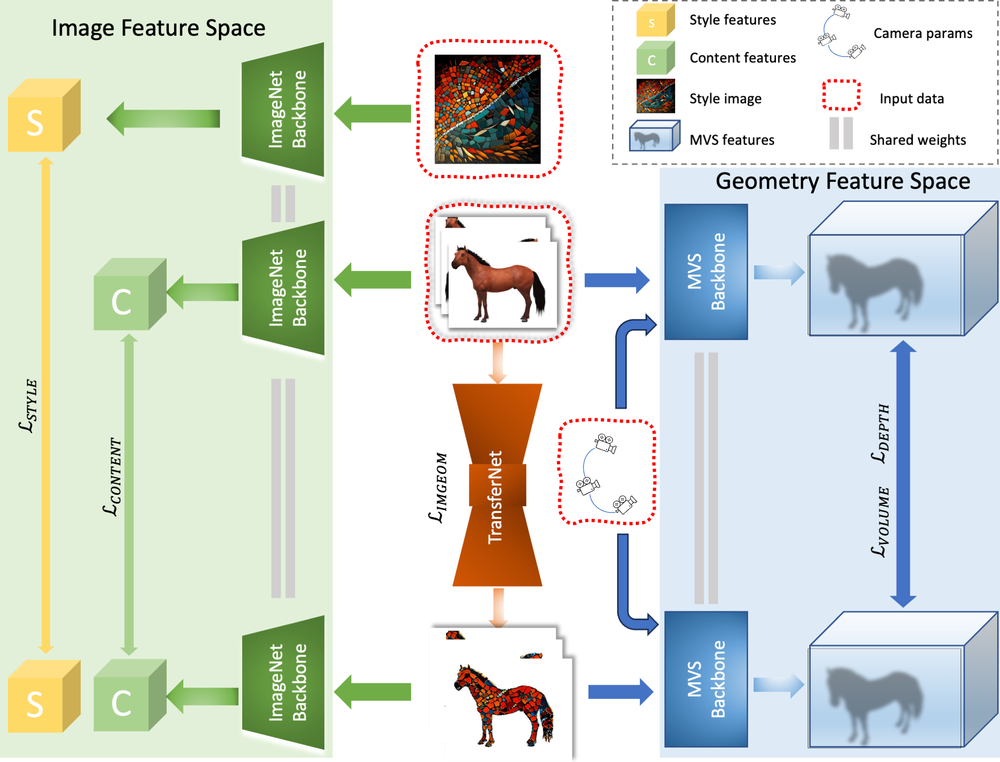

# MuVieCAST: Multi-View Consistent Artistic Style Transfer
[Project page](https://muviecast.github.io) | [Paper](#) 

#### *Official PyTorch implementation of MuVieCAST: Multi-View Consistent Artistic Style Transfer.*

>

## Installation from enviroinment file

```
conda env create -f muviecast.yml
conda activate muviecast
```

## Tested Hardware
- Ubuntu 20.04
- Single and Dual [ RTX 2080, A10,  A100 ]


## Training


For checking all the training options, check opt.py. Feel free to check supplementary material for more insights for loss weights.


Training command:
```
python train.py --root_dir <root_dir> --scan_name <scan_name> --style_name <style_name>  --num_epochs <epochs> --img_wh <width height> --lambda_depth <depth_weight> --lambda_structure <structure_weight> --lambda_style <style_weight> --lambda_content <content_weight>  --num_gpus <num_gpus>  --output_dir <output_dir> [--unet_weights <unet_weights>] [--use_adain] [--use_casmvsnet]
```

### Simple training examples
```
#PatchmatchNet+UNet
python train.py --root_dir ./data --scan_name Train --style_name greatwave --unet_weights greatwave.pth --num_epochs 5 --img_wh 640 352 --lambda_depth 1e4 --lambda_structure 2e4 --lambda_style 1e8 --lambda_content 1e3  --num_gpus 2 --output_dir Train_greatwave_patchmatchnet_unet

#PatchmatchNet+Adain (consider increasing the weights of content/depth/structure for better geometry)
python train.py --root_dir ./data --scan_name Train --style_name greatwave  --num_epochs 5 --img_wh 640 352 --lambda_depth 1e4 --lambda_structure 2e4 --lambda_style 1e4 --lambda_content 3e2  --num_gpus 2 --output_dir Train_greatwave_patchmatchnet_adain --use_adain

#CasMVSNet+UNet
python train.py --root_dir ./data --scan_name Train --style_name greatwave --unet_weights greatwave.pth --num_epochs 5 --img_wh 640 352 --lambda_depth 1e4 --lambda_structure 2e4 --lambda_style 1e8 --lambda_content 1e3  --num_gpus 2 --output_dir Train_greatwave_casmvsnet_unet --use_casmvsnet


#CasMVSNet+Adain (consider increasing the weights of content/depth/structure for better geometry)
python train.py --root_dir ./data --scan_name Train --style_name greatwave  --num_epochs 5 --img_wh 640 352 --lambda_depth 1e4 --lambda_structure 2e4 --lambda_style 1e4 --lambda_content 3e2  --num_gpus 2 --output_dir Train_greatwave_casmvsnet_adain --use_casmvsnet --use_adain

```

For training with CasMVSNet with your own custom dataset, you may need to add image_size and depth_interval in datasets/custom.py. Please refer to [CasMVSNet](https://github.com/kwea123/CasMVSNet_pl) for further details.

Due to coarse-to-fine training strategy, both width and height of the input image should be divisible by 32.

## Acknowledgements:
#### Mutli-View Stereo:

- [CasMVSNet](https://github.com/kwea123/CasMVSNet_pl)
- [PatchmatchNet](https://github.com/FangjinhuaWang/PatchmatchNet)

#### Style Transfer:
- [Neural Style Transfer](https://arxiv.org/abs/1508.06576)
- [Fast Neural Style Transfer](https://arxiv.org/abs/1603.08155)
- [AdaIN](https://arxiv.org/abs/1703.06868)
- [ARF](https://arxiv.org/abs/2206.06360)


#### Neural Rendering:
- [Nerfstudio](https://docs.nerf.studio/)
- [Instant-ngp](https://github.com/NVlabs/instant-ngp)

## Bibtex
```
@article{???,
  author    = {Nail Ibrahimli, Julian F. P. Kooij, and Liangliang Nan},
  title     = {MuVieCAST: Multi-View Consistent Artistic Style Transfer},
  journal   = {3DV},
  year      = {2024},
}
```